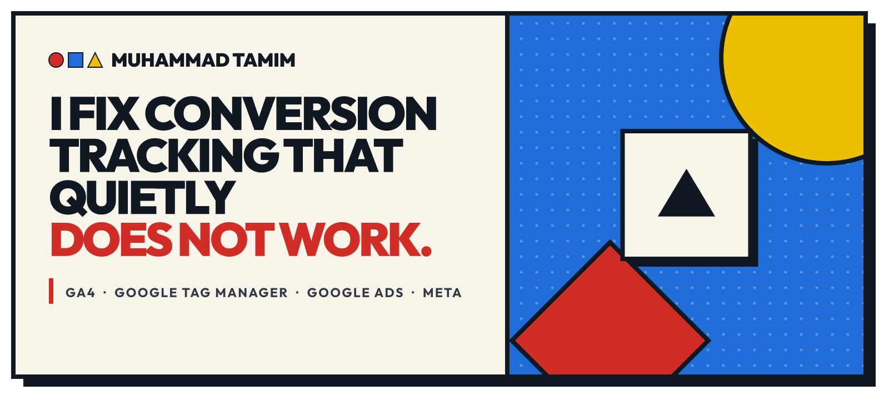
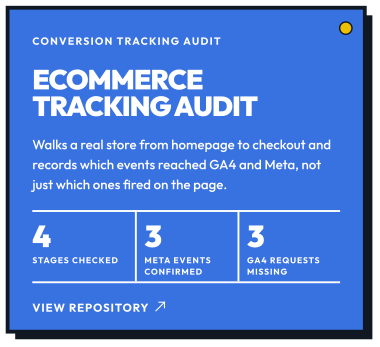
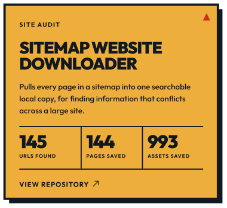

<picture>
  <source media="(max-width: 600px) and (prefers-color-scheme: dark)" srcset="assets/banner-phone-dark.svg">
  <source media="(max-width: 600px)" srcset="assets/banner-phone-light.svg">
  <source media="(prefers-color-scheme: dark)" srcset="assets/banner-dark.svg">
  
</picture>

I implement and debug conversion tracking in GA4, Google Tag Manager, Google Ads and Meta, and I check what each platform actually receives, not just what fired on the page.

  <a href="https://muhammadtamim.com"><picture><source media="(prefers-color-scheme: dark)" srcset="assets/btn-website-dark.svg"></picture></a>&nbsp;
  <a href="https://www.linkedin.com/in/meetmuhammadtamim/"><picture><source media="(prefers-color-scheme: dark)" srcset="assets/btn-linkedin-dark.svg"></picture></a>&nbsp;
  <a href="https://www.facebook.com/meetmuhammadtamim/"><picture><source media="(prefers-color-scheme: dark)" srcset="assets/btn-facebook-dark.svg"></picture></a>

 

<picture>
  <source media="(max-width: 600px) and (prefers-color-scheme: dark)" srcset="assets/head-tools-phone-dark.svg">
  <source media="(max-width: 600px)" srcset="assets/head-tools-phone-light.svg">
  <source media="(prefers-color-scheme: dark)" srcset="assets/head-tools-dark.svg">
  
</picture>

  <a href="https://github.com/meetmuhammadtamim/ecommerce-tracking-audit"><picture><source media="(prefers-color-scheme: dark)" srcset="assets/tool-ecommerce-dark.svg"></picture></a>
  <a href="https://github.com/meetmuhammadtamim/sitemap-site-downloader"><picture><source media="(prefers-color-scheme: dark)" srcset="assets/tool-sitemap-dark.svg"></picture></a>

<a href="https://github.com/meetmuhammadtamim/ecommerce-tracking-audit"><b>ecommerce-tracking-audit</b></a>: walks a real store from homepage to checkout in a browser and records which events reached GA4 and Meta. In testing it found GA4 events that looked fine in the dataLayer while no GA4 request was ever sent.

<a href="https://github.com/meetmuhammadtamim/sitemap-site-downloader"><b>sitemap-site-downloader</b></a>: pulls every page in a sitemap into one searchable local copy, for finding information that conflicts across a large site.

 

<picture>
  <source media="(max-width: 600px) and (prefers-color-scheme: dark)" srcset="assets/head-background-phone-dark.svg">
  <source media="(max-width: 600px)" srcset="assets/head-background-phone-light.svg">
  <source media="(prefers-color-scheme: dark)" srcset="assets/head-background-dark.svg">
  
</picture>

I studied Computer Science and Engineering and worked as a web developer before moving into tracking. Old habits stayed with me: when the numbers look wrong, I still start by reading the code.

